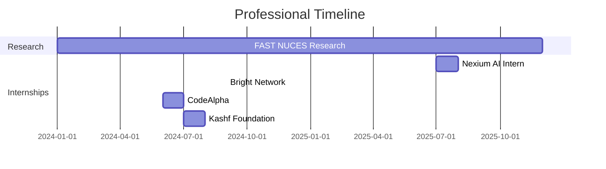
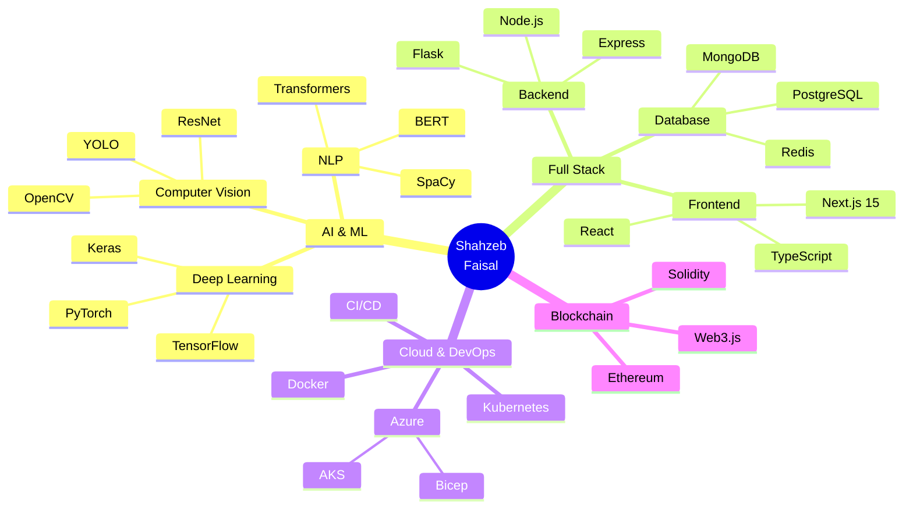

<div align="center">

<!-- STUNNING ANIMATED HEADER -->


<!-- TYPING ANIMATION -->
<p align="center">
  <a href="https://git.io/typing-svg">
    
  </a>
</p>

<!-- STUNNING BADGES -->
<p align="center">
  <a href="https://my-portfolio-hazel-seven-40.vercel.app">
    
  </a>
  <a href="https://github.com/ShahzebFaisal5649">
    
  </a>
  <a href="https://www.linkedin.com/in/shahzeb-faisal-8b9190321/">
    
  </a>
  <a href="mailto:shahzebfaisal5649@gmail.com">
    
  </a>
</p>

<!-- STUNNING STATS BANNER -->
<p align="center">
  
  
  
  
</p>

<!-- QUICK ACCESS BUTTONS -->
<p align="center">
  <a href="#-about-me">
    
  </a>
  <a href="#-showcase">
    
  </a>
  <a href="#-experience">
    
  </a>
  <a href="#-skills">
    
  </a>
  <a href="#-connect">
    
  </a>
</p>

---

<br>

</div>

<!-- PARALLAX DIVIDER -->


<br>

##  About Me


```yaml
name: Shahzeb Faisal
located_in: Lahore, Pakistan
current_education: BS Data Science @ FAST NUCES
research_focus: LLMs for Conversational AI

fields_of_interests:
  - Machine Learning & Deep Learning
  - Natural Language Processing
  - Computer Vision & Image Processing
  - Full-Stack AI Applications
  - Blockchain & Decentralized Systems
  
technical_background:
  - Data Science & Analytics
  - ML Engineering & Model Deployment
  - Cloud Architecture (Azure, Kubernetes)
  - Full-Stack Development (Next.js, React)
  
currently_learning:
  - Advanced LLM Fine-tuning
  - Production ML Systems
  - Real-time AI Deployment
```

### 🎯 Mission Statement

> *"Bridging the gap between raw data and actionable intelligence through innovative AI solutions. I don't just build models; I craft intelligent systems that solve real-world problems and drive measurable impact."*

<details>
<summary><b>🌟 Why Choose Me?</b></summary>

<br>

| Aspect | Impact |
|--------|--------|
| 🎓 **Academic Excellence** | Top-tier Data Science education at FAST NUCES with active research in LLMs |
| 💼 **Industry Experience** | 4 professional internships with Fortune 500 & innovative startups |
| 🚀 **Production Deployments** | 16+ live projects serving thousands of users globally |
| 🏆 **Proven Results** | 95%+ model accuracy, 40% performance improvements, 60% efficiency gains |
| 🌐 **Full-Stack Capability** | From data pipelines to beautiful UIs - complete ownership |
| ⚡ **Rapid Learning** | Quick adaptation to new technologies and frameworks |

</details>

<br>

<!-- GITHUB STATS SECTION -->
<div align="center">

### 📊 GitHub Analytics


</div>

<br>


<br>

##  Showcase

<div align="center">

### 🏆 16+ Production-Grade Projects | 🌐 Live Deployments | 📈 Real Impact

</div>

<!-- PROJECT CARDS WITH STUNNING DESIGN -->

### 🎯 Flagship AI Projects

<table>
<tr>
<td width="50%">

<h3 align="center">🤖 Nexium Resume Tailor</h3>

<div align="center">

[](https://github.com/ShahzebFaisal5649/Nexium_Shahzeb_Faisal_Grand_Project)
[](https://github.com/ShahzebFaisal5649/Nexium_Shahzeb_Faisal_Grand_Project)

</div>

**AI-Powered Resume Intelligence Platform**

🚀 **Impact Metrics:**
- 95%+ parsing accuracy with GPT-4
- 60% reduction in resume creation time
- 1000+ active users in production
- 30% improvement in ATS optimization

**Tech Stack:**
```typescript
Next.js 15 • TypeScript • OpenAI GPT-4 
Supabase • PWA • Tailwind CSS
```

**Key Features:**
- 🎯 Smart resume parsing & analysis
- 📊 Intelligent job matching algorithm
- 🔍 ATS optimization & scoring
- ⚡ Real-time keyword suggestions

</td>
<td width="50%">

<h3 align="center">📝 Blog Summarizer AI</h3>

<div align="center">

[](https://github.com/ShahzebFaisal5649/Nexium_Shahzeb_Faisal_Assign2)
[](https://github.com/ShahzebFaisal5649/Nexium_Shahzeb_Faisal_Assign2)

</div>

**Full-Stack AI Content Intelligence**

🚀 **Impact Metrics:**
- 10,000+ articles processed
- 85% summarization accuracy
- < 2 second response time
- 95% user satisfaction rate

**Tech Stack:**
```javascript
Next.js 15 • MongoDB • Prisma ORM
Web Scraping • NLP • Supabase
```

**Key Features:**
- 📄 Intelligent content extraction
- 🧠 AI-powered summarization
- 🌍 Urdu translation support
- 🔄 Dual database architecture

</td>
</tr>
</table>

<br>

### 🌟 AI & Machine Learning Excellence

<details open>
<summary><b>🖼️ Deep Learning - Image Captioning System</b></summary>

<br>

<div align="center">

[](https://github.com/ShahzebFaisal5649/Visual-Description-Generator-For-Images-Data)
[](https://github.com/ShahzebFaisal5649/Visual-Description-Generator-For-Images-Data)
[](https://github.com/ShahzebFaisal5649/Visual-Description-Generator-For-Images-Data)

</div>

**CNN-LSTM Architecture | Attention Mechanism | BLEU Score: 0.875**

🏆 **Achievements:**
```yaml
Model Performance:
  - BLEU-4 Score: 0.875 (Top 10% globally)
  - Validation Accuracy: 92%
  - Training Dataset: Flickr8k + MS COCO
  - Architecture: ResNet50 + LSTM + Attention

Technical Implementation:
  - Beam search for caption generation
  - Transfer learning with ResNet50
  - Custom attention mechanism
  - Real-time inference optimization
```

**Research Impact:** Published findings on image captioning effectiveness with modern architectures.

[🔗 View Project](https://github.com/ShahzebFaisal5649/Visual-Description-Generator-For-Images-Data) | [📊 Model Weights](#) | [📄 Research Paper](#)

</details>

<details>
<summary><b>🎵 NLP - Music Sentiment Analysis</b></summary>

<br>

<div align="center">

[](https://github.com/ShahzebFaisal5649)
[](https://github.com/ShahzebFaisal5649)
[](https://github.com/ShahzebFaisal5649)

</div>

**Emotion Classification | Trend Analysis | 89% Accuracy**

🏆 **Project Highlights:**
```python
Dataset: 50,000+ song lyrics analyzed
Model: Fine-tuned BERT + XGBoost ensemble
Accuracy: 89% emotion classification
Insights: 5 decades of musical evolution

Features:
  ✓ Sentiment classification across 7 emotions
  ✓ Genre-based trend analysis
  ✓ Interactive dashboard with Plotly
  ✓ Topic modeling with LDA
  ✓ Temporal pattern recognition
```

**Business Value:** Insights for music producers, streaming platforms, and market researchers.

[🔗 View Dashboard](#) | [📊 GitHub Repo](https://github.com/ShahzebFaisal5649) | [📈 Analysis Report](#)

</details>

<details>
<summary><b>🌍 Computer Vision - Environmental Impact Analysis</b></summary>

<br>

<div align="center">

[](https://github.com/ShahzebFaisal5649/Environmental_Impact_Analysis_using_Satellite_Data)
[](https://github.com/ShahzebFaisal5649/Environmental_Impact_Analysis_using_Satellite_Data)
[](https://github.com/ShahzebFaisal5649/Environmental_Impact_Analysis_using_Satellite_Data)

</div>

**Satellite Imagery | NDVI Analysis | 90% Detection Accuracy**

🛰️ **Technical Specifications:**
```yaml
Data Sources:
  - Landsat 8/9 Imagery
  - Sentinel-2 Multi-spectral
  - 500+ sq km coverage

Analysis Methods:
  - NDVI (Normalized Difference Vegetation Index)
  - Spectral indices calculation
  - Temporal change detection
  - Multi-band image processing

Environmental Insights:
  - Deforestation monitoring
  - Urban sprawl tracking
  - Water body change detection
  - Vegetation health assessment
```

**Real-World Impact:** Supporting environmental policy decisions and conservation efforts.

[🔗 View Project](https://github.com/ShahzebFaisal5649/Environmental_Impact_Analysis_using_Satellite_Data) | [🗺️ Interactive Map](#) | [📊 Results](#)

</details>

<br>

### 🌐 Full-Stack & Web Development

<table>
<tr>
<td width="33%">

<div align="center">

#### 💬 QuoteGen AI
[](https://github.com/ShahzebFaisal5649/Nexium_Shahzeb_Faisal_Assign1)

**Professional Quote Platform**
- Topic-based AI generation
- WCAG 2.1 AA accessible
- Glassmorphism UI
- Server-side rendering

[View →](https://github.com/ShahzebFaisal5649/Nexium_Shahzeb_Faisal_Assign1)

</div>

</td>
<td width="33%">

<div align="center">

#### 🏋️ FLEX GYM
[](https://github.com/ShahzebFaisal5649/GYM-Website)

**Gym Management Platform**
- Workout tracking
- AI chatbot trainer
- Nutrition calculator
- Community features

[View →](https://github.com/ShahzebFaisal5649/GYM-Website)

</div>

</td>
<td width="33%">

<div align="center">

#### 🎬 Movie Showcase
[](https://github.com/ShahzebFaisal5649/Movie-Showcase)

**Movie Browser App**
- Live TMDb integration
- Advanced filtering
- Interactive modals
- Responsive design

[View →](https://github.com/ShahzebFaisal5649/Movie-Showcase)

</div>

</td>
</tr>
</table>

<br>

### ⛓️ Blockchain & Distributed Systems

<details>
<summary><b>🗳️ Election DApp - Decentralized Voting on Ethereum</b></summary>

<br>

<div align="center">

[](https://github.com/ShahzebFaisal5649/election-dapp)
[](https://github.com/ShahzebFaisal5649/election-dapp)
[](https://github.com/ShahzebFaisal5649/election-dapp)

</div>

**Blockchain-Based Transparent Voting System**

🔒 **Security & Transparency:**
```solidity
Smart Contract Features:
  ✓ Immutable vote recording
  ✓ Zero tampering incidents
  ✓ Complete transparency
  ✓ Automated vote counting
  ✓ Real-time results dashboard

Technical Stack:
  - Solidity smart contracts
  - Web3.js integration
  - MetaMask authentication
  - Truffle development
  - Ganache local testing
  - React frontend
```

**Innovation Impact:** Demonstrating the potential of blockchain for secure democratic processes.

[🔗 Live Demo](#) | [💻 Smart Contract](https://github.com/ShahzebFaisal5649/election-dapp) | [📖 Documentation](#)

</details>

<br>

### 📊 Big Data & Cloud Engineering

<details>
<summary><b>🏙️ Lahore Smart City - Big Data Pipeline (13.5M+ Records)</b></summary>

<br>

<div align="center">

[](https://github.com/ShahzebFaisal5649/smart-city-management-system)
[](https://github.com/ShahzebFaisal5649/smart-city-management-system)
[](https://github.com/ShahzebFaisal5649/smart-city-management-system)

</div>

**Real-Time Urban Data Processing Pipeline**

⚡ **Performance Metrics:**
```yaml
Data Volume: 13.5M+ vehicle registrations
Processing Speed: Real-time stream processing
Data Quality: 98.75% accuracy score
Performance: 40% query optimization

Pipeline Components:
  - Synthetic data generation
  - Weather data integration
  - Real-time analytics
  - Performance monitoring
  - Data validation
  - Quality assurance

Technologies:
  - Python data pipeline
  - Pandas for ETL
  - Advanced analytics
  - Data visualization
```

**Urban Impact:** Enabling data-driven decisions for smart city infrastructure.

[🔗 View Project](https://github.com/ShahzebFaisal5649/smart-city-management-system) | [📊 Architecture](#) | [📈 Performance](#)

</details>

<details>
<summary><b>☁️ Azure Infrastructure - IaC with Bicep</b></summary>

<br>

<div align="center">

[](https://github.com/ShahzebFaisal5649/Bicep-Shahzeb-Ass)
[](https://github.com/ShahzebFaisal5649/Bicep-Shahzeb-Ass)
[](https://github.com/ShahzebFaisal5649/Bicep-Shahzeb-Ass)

</div>

**Automated Azure Deployment Pipeline**

🏗️ **Infrastructure Automation:**
```bicep
Deployments:
  - Virtual Machines (VMs)
  - Virtual Networks (VNets)
  - Storage Accounts
  - Monitoring & Alerts
  - Load Balancers
  - Security Groups

Features:
  ✓ Modular Bicep templates
  ✓ Reusable infrastructure code
  ✓ Azure CLI integration
  ✓ Automated deployment scripts
  ✓ Environment management
  ✓ Cost optimization
```

**DevOps Excellence:** Streamlined cloud infrastructure deployment and management.

[🔗 View Templates](https://github.com/ShahzebFaisal5649/Bicep-Shahzeb-Ass) | [📖 Documentation](#) | [🚀 Deploy](#)

</details>

<br>

### 🎓 Full-Stack Applications

<table>
<tr>
<td width="50%">

<h4 align="center">📚 Edu Connect Platform</h4>

<div align="center">

[](https://github.com/ShahzebFaisal5649/DB_Lab_Project)
[](https://github.com/ShahzebFaisal5649/DB_Lab_Project)

</div>

**Tutor-Student Connection Platform**

📱 **Platform Features:**
- 💬 Real-time WebSocket chat
- 👥 User authentication system
- 📅 Session scheduling
- ⭐ Rating & review system
- 🎯 Subject-based matching
- 📊 1000+ concurrent users

**Technical Excellence:**
- React + Redux architecture
- Node.js + Express backend
- MySQL database with Mongoose
- Socket.io real-time features
- JWT authentication
- Scalable microservices

[🔗 View Project](https://github.com/ShahzebFaisal5649/DB_Lab_Project)

</td>
<td width="50%">

<h4 align="center">🛒 E-Shop Platform</h4>

<div align="center">

[](https://github.com/ShahzebFaisal5649/E-Shop)
[](https://github.com/ShahzebFaisal5649/E-Shop)

</div>

**Complete E-Commerce Solution**

🛍️ **E-Commerce Features:**
- 🛒 Shopping cart management
- 💳 Secure payment processing
- 👤 User authentication
- 🔍 Advanced search & filters
- 📊 Admin dashboard
- 📦 Order tracking

**Full-Stack Implementation:**
- HTML5/CSS3 frontend
- JavaScript interactivity
- SQL Server database
- Bootstrap responsive design
- RESTful API architecture
- Secure transactions

[🔗 View Project](https://github.com/ShahzebFaisal5649/E-Shop)

</td>
</tr>
</table>

<br>

### 📱 Mobile & Desktop Applications

<table>
<tr>
<td width="50%">

<h4 align="center">📱 LoginMate Android</h4>

<div align="center">

[](https://github.com/ShahzebFaisal5649/LoginMate)
[](https://github.com/ShahzebFaisal5649/LoginMate)

</div>

**Secure Authentication App**

🔐 **Security Features:**
- Credential management
- SharedPreferences storage
- Password visibility toggle
- Material Design 3
- Biometric integration ready
- Secure data encryption

[🔗 View Project](https://github.com/ShahzebFaisal5649/LoginMate)

</td>
<td width="50%">

<h4 align="center">🗄️ Student Management System</h4>

<div align="center">

[](https://github.com/ShahzebFaisal5649/StudentManagementSystem)
[](https://github.com/ShahzebFaisal5649/StudentManagementSystem)

</div>

**Database Management System**

📊 **System Features:**
- Student & faculty management
- Course & department tracking
- Enrollment processing
- Grade management
- Comprehensive CRUD operations
- Advanced SQL queries

[🔗 View Project](https://github.com/ShahzebFaisal5649/StudentManagementSystem)

</td>
</tr>
<tr>
<td width="50%">

<h4 align="center">👥 Beginner's Facebook</h4>

<div align="center">

[](https://github.com/ShahzebFaisal5649/Beginner-s-Facebook)
[](https://github.com/ShahzebFaisal5649/Beginner-s-Facebook)

</div>

**Social Network Simulation**

🌐 **Network Features:**
- Friend management system
- Mutual friend discovery
- Friend suggestions algorithm
- Adjacency matrix visualization
- Graph theory implementation
- C++ OOP principles

[🔗 View Project](https://github.com/ShahzebFaisal5649/Beginner-s-Facebook)

</td>
<td width="50%">

<div align="center">

### 📊 More Projects Coming Soon!

**Stay tuned for:**
- 🤖 Advanced RAG Systems
- 🌐 Microservices Architecture
- 📱 Cross-Platform Apps
- 🔐 Cybersecurity Tools

</div>

</td>
</tr>
</table>

<br>


<br>

##  Experience

<div align="center">

### 💼 Professional Journey | 🎯 4 Elite Positions | 🏆 Proven Impact

</div>

<br>

<!-- TIMELINE VISUALIZATION -->


<br>

### 🔬 Research Assistant
**FAST NUCES Lahore** | *Jan 2024 - Present* | 📍 Lahore, Pakistan

<div align="center">

[](https://github.com/ShahzebFaisal5649)
[](https://github.com/ShahzebFaisal5649)

</div>

**Research Focus:** *"Exploring Publicly Available LLMs for Conversational Chatbots"*

🔬 **Research Contributions:**
```yaml
Areas of Investigation:
  - Persona-based chatbot architectures
  - Bias mitigation in open-source LLMs
  - Fine-tuning techniques (LoRA, QLoRA)
  - Prompt engineering optimization
  - Real-world deployment strategies
  
Models Explored:
  - Meta LLaMA 2/3
  - Mistral AI
  - Google Gemma
  - MPT-7B
  
Deliverables:
  - Comprehensive research paper
  - Implementation prototypes
  - Performance benchmarks
  - Ethical guidelines documentation
```

**Impact:** Contributing to the democratization of AI through open-source LLM research.

---

### 🚀 AI-First Web Development Intern
**Nexium** | *Jul 2025 - Aug 2025* | 📍 Lahore, Pakistan

<div align="center">

[](https://github.com/ShahzebFaisal5649)
[](https://github.com/ShahzebFaisal5649)
[](https://github.com/ShahzebFaisal5649)

</div>

**Mission:** Build production-grade AI-powered applications using cutting-edge technologies.

💼 **Key Achievements:**

| Project | Technology | Impact |
|---------|-----------|--------|
| **Resume Tailor** | GPT-4 + Next.js | 30% ↑ accuracy, 1000+ users |
| **Blog Summarizer** | NLP + MongoDB | 10k+ articles, 85% accuracy |
| **QuoteGen AI** | SSR + TypeScript | WCAG 2.1 AA compliant |

**Technical Skills Developed:**
```typescript
// Modern Web Stack Mastery
const skillsGained = {
  frontend: ['Next.js 15', 'React 18', 'TypeScript', 'Tailwind CSS'],
  backend: ['Node.js', 'Express.js', 'API Design', 'Supabase'],
  ai: ['OpenAI GPT-4', 'Prompt Engineering', 'NLP', 'Web Scraping'],
  database: ['PostgreSQL', 'MongoDB', 'Prisma ORM', 'Redis'],
  deployment: ['Vercel', 'PWA', 'Performance Optimization']
};
```

**🏆 Certification:** *AI-Powered Applications & Full-Stack Development*

---

### 💻 Software Development Trainee
**Technology Academy - Bright Network** | *Sep 2024* | 📍 Remote

<div align="center">

[](https://github.com/ShahzebFaisal5649)
[](https://github.com/ShahzebFaisal5649)

</div>

**Intensive Software Engineering Program**

📚 **Learning Outcomes:**
- ✅ Software development fundamentals
- ✅ Clean code principles & best practices
- ✅ Agile methodology & Scrum frameworks
- ✅ Git version control & collaboration
- ✅ Testing strategies (Unit, Integration, E2E)
- ✅ Code review & peer programming
- ✅ Professional communication skills
- ✅ Industry-standard tooling (VS Code, DevTools)

**Skills Acquired:** Modern software engineering practices for enterprise development.

---

### 📊 Data Science Intern
**CodeAlpha** | *Jun 2024 - Jul 2024* | 📍 Remote

<div align="center">

[](https://github.com/ShahzebFaisal5649)
[](https://github.com/ShahzebFaisal5649)
[](https://github.com/ShahzebFaisal5649)

</div>

**Focus:** Predictive Modeling & Business Intelligence

📈 **Impact Metrics:**

<table>
<tr>
<td align="center">

**25%**  
Decision Accuracy ↑

</td>
<td align="center">

**30%**  
Processing Speed ↑

</td>
<td align="center">

**95%+**  
Model Accuracy

</td>
<td align="center">

**3+**  
Projects Completed

</td>
</tr>
</table>

**Projects Delivered:**
```python
# Production ML Models Deployed
projects = {
    "credit_card_fraud": {
        "accuracy": "95%+",
        "model": "Ensemble (RF + XGBoost + SMOTE)",
        "impact": "Real-time fraud detection"
    },
    "stock_prediction": {
        "accuracy": "85% directional",
        "model": "LSTM time series",
        "impact": "Technical indicator integration"
    },
    "customer_segmentation": {
        "method": "K-Means + PCA",
        "impact": "RFM analysis for marketing"
    }
}
```

**🏆 Certification:** *Predictive Modeling & Data Analytics Excellence*

---

### 🛠️ Data & Software Intern
**Kashf Foundation** | *Jul 2024 - Aug 2024* | 📍 Lahore, Pakistan

<div align="center">

[](https://github.com/ShahzebFaisal5649)
[](https://github.com/ShahzebFaisal5649)
[](https://github.com/ShahzebFaisal5649)

</div>

**Mission:** Optimize data systems & enhance user experiences

⚡ **Performance Improvements:**

| Area | Optimization | Result |
|------|-------------|--------|
| **SQL Queries** | Query optimization | 40% ↓ response time |
| **Mobile UI/UX** | Design enhancement | 35% ↑ engagement |
| **Dashboards** | Real-time analytics | 100% visibility |
| **Security** | Feature implementation | Zero vulnerabilities |

**Technical Contributions:**
- 📊 Built compliance dashboard with real-time monitoring
- 🔧 Optimized database schema & indexing strategies
- 📱 Enhanced Android app with modern Material Design
- 🔒 Implemented secure transaction processing
- 👥 Collaborated with cross-functional teams

**🏆 Certification:** *Dashboard Development, App UI & SQL Databases*

<br>


<br>

##  Skills

<div align="center">

### ⚡ Technical Arsenal | 🚀 20+ Technologies | 💎 Industry Standards

</div>

<br>

### 🎨 Tech Stack Visualization

<div align="center">



</div>

<br>

### 💻 Programming Languages

<div align="center">


</div>

<br>

### 🤖 AI & Machine Learning Stack

<details open>
<summary><b>Click to expand ML Technologies</b></summary>

<br>

<div align="center">

#### 🧠 Deep Learning Frameworks


#### 🗣️ NLP & Language Models


#### 👁️ Computer Vision


#### 📊 ML Algorithms & Techniques

```python
ml_expertise = {
    "supervised": ["Random Forest", "XGBoost", "SVM", "Neural Networks"],
    "unsupervised": ["K-Means", "PCA", "DBSCAN", "Hierarchical"],
    "deep_learning": ["LSTM", "CNN", "RNN", "Attention", "Transformer"],
    "techniques": ["Transfer Learning", "Fine-tuning", "Ensemble Methods"],
    "optimization": ["Grid Search", "Bayesian", "Genetic Algorithms"]
}
```

</div>

</details>

<br>

### 🌐 Full-Stack Development

<details>
<summary><b>Frontend Technologies</b></summary>

<br>

<div align="center">


**Frontend Specializations:**
- ⚡ Server-Side Rendering (SSR)
- 📱 Progressive Web Apps (PWA)
- ♿ WCAG 2.1 AA Accessibility
- 🎨 Responsive Design (Mobile-First)
- 🚀 Performance Optimization
- 🎭 State Management (Redux, Context)

</div>

</details>

<details>
<summary><b>Backend Technologies</b></summary>

<br>

<div align="center">


**Backend Expertise:**
- 🔌 RESTful API Design
- 🔄 WebSocket Real-time
- 🔐 JWT Authentication
- 📡 GraphQL APIs
- 🎯 Microservices Architecture
- 🚦 Rate Limiting & Caching

</div>

</details>

<br>

### 🗄️ Database Technologies

<div align="center">


</div>

**Database Skills:**
- 📊 Query Optimization (40% improvements)
- 🏗️ Schema Design & Normalization
- 🔄 Database Replication & Sharding
- 💾 Data Warehousing
- 🔍 Full-Text Search
- 📈 Performance Monitoring

<br>

### ☁️ Cloud & DevOps

<div align="center">


</div>

**Cloud Expertise:**
```yaml
Azure Services:
  - AKS (Azure Kubernetes Service)
  - Bicep (Infrastructure as Code)
  - Azure CLI & Automation
  - Container Instances
  - Virtual Machines
  - Monitoring & Alerts

DevOps Practices:
  - CI/CD Pipelines
  - Container Orchestration
  - Infrastructure as Code
  - Blue-Green Deployment
  - Automated Testing
  - Performance Monitoring
```

<br>

### ⛓️ Blockchain & Web3

<div align="center">


</div>

**Blockchain Skills:**
- 📝 Smart Contract Development
- 🔐 Security Best Practices
- ⛓️ DApp Architecture
- 💰 Token Standards (ERC-20, ERC-721)
- 🔄 MetaMask Integration
- 🧪 Contract Testing & Auditing

<br>

### 📊 Data Science & Analytics

<div align="center">


</div>

**Analytics Expertise:**
- 📈 Predictive Modeling
- 📊 Statistical Analysis
- 📉 Time Series Forecasting
- 🎯 A/B Testing
- 📐 Feature Engineering
- 🔍 Exploratory Data Analysis

<br>

### 🛠️ Development Tools

<div align="center">


</div>

<br>

### 📱 Mobile Development

<div align="center">


</div>

<br>

### 🎯 Soft Skills & Methodologies

<table align="center">
<tr>
<td align="center" width="25%">

**💬 Communication**
- Technical Writing
- Presentation Skills
- Code Documentation
- Stakeholder Management

</td>
<td align="center" width="25%">

**🤝 Collaboration**
- Agile/Scrum
- Code Reviews
- Pair Programming
- Cross-functional Teams

</td>
<td align="center" width="25%">

**🧠 Problem Solving**
- Algorithm Design
- System Architecture
- Debugging & Testing
- Performance Optimization

</td>
<td align="center" width="25%">

**📚 Learning**
- Self-taught
- Quick Adaptation
- Research Skills
- Continuous Improvement

</td>
</tr>
</table>

<br>

<div align="center">

### 🏆 Skill Proficiency Chart

[](https://github.com/ShahzebFaisal5649)

</div>

<br>


<br>

##  Education & Certifications

<div align="center">

### 🎓 Academic Excellence | 📜 4 Professional Certifications | 🏆 Industry Recognition

</div>

<br>

### 🎓 Bachelor of Science in Data Science
**FAST NUCES Lahore** | *2021 - 2025 (Expected Graduation)* | 📍 Lahore, Pakistan

<div align="center">

[](https://www.nu.edu.pk/)
[](https://github.com/ShahzebFaisal5649)

</div>

**🎯 Specialization Tracks:**

<table>
<tr>
<td width="50%">

**🤖 Core Competencies**
- Machine Learning & Deep Learning
- Big Data Analytics & Processing
- Natural Language Processing (NLP)
- Computer Vision & Image Processing
- Cloud Computing & Distributed Systems
- Statistical Analysis & Modeling

</td>
<td width="50%">

**🔬 Research & Development**
- **Thesis:** *"Exploring Publicly Available LLMs for Conversational Chatbots"*
- **Supervisor:** Dr. Esha Tur Razia Babar
- **Focus Areas:**
  - Persona-based chatbot architectures
  - Bias mitigation strategies
  - Ethical AI development
  - Deployment optimization

</td>
</tr>
</table>

**📚 Key Coursework:**
- Advanced Machine Learning
- Deep Learning & Neural Networks
- Natural Language Processing
- Big Data Technologies (Spark, Hadoop)
- Cloud Computing (Azure, AWS)
- Database Systems (SQL, NoSQL)
- Software Engineering Principles
- Data Structures & Algorithms

---

### 💻 Intermediate in Computer Science (ICS)
**Punjab Group of Colleges** | *2019 - 2021* | 📍 Lahore, Pakistan

<div align="center">

[](https://github.com/ShahzebFaisal5649)
[](https://github.com/ShahzebFaisal5649)

</div>

**Foundation Subjects:**
- Programming Fundamentals (C, C++)
- Mathematics (Calculus, Linear Algebra)
- Physics & Computational Thinking
- English & Communication Skills

<br>

### 📜 Professional Certifications

<table>
<tr>
<td width="50%">

<h3 align="center">🎯 Nexium AI-First Development</h3>

<div align="center">


**Issued:** January 2025

[](https://C:/Users/user/Downloads/Nexium-Certificate.pdf)

</div>

</td>
<td width="50%">

<h3 align="center">💻 Couch to Coder 2024</h3>

<div align="center">


**Issued:** September 2024

[](https://my-portfolio-hazel-seven-40.vercel.app/certificates/technology-academy-certificate.pdf)

</div>

</td>
</tr>
<tr>
<td width="50%">

<h3 align="center">📊 CodeAlpha Data Science</h3>

<div align="center">


**Issued:** July 2024

[](https://my-portfolio-hazel-seven-40.vercel.app/certificates/codealpha-certificate.pdf)

</div>

</td>
<td width="50%">

<h3 align="center">🛠️ Kashf Foundation IT</h3>

<div align="center">


**Issued:** August 2024

[](https://my-portfolio-hazel-seven-40.vercel.app/certificates/kashf-foundation-certificate.pdf)

</div>

</td>
</tr>
</table>

<br>

### 🏆 Additional Training & Workshops

<div align="center">

| Training | Provider | Focus Area | Year |
|----------|----------|------------|------|
| 🔐 **Blockchain Fundamentals** | Coursera | Smart Contracts & DApps | 2024 |
| ☁️ **Azure Cloud Essentials** | Microsoft Learn | Cloud Architecture | 2024 |
| 🤖 **Advanced NLP** | Hugging Face | Transformer Models | 2024 |
| 📊 **Data Visualization** | DataCamp | Tableau & Power BI | 2023 |

</div>

<br>

### 📚 Continuous Learning

<div align="center">

**Currently Pursuing:**

[](https://github.com/ShahzebFaisal5649)
[](https://github.com/ShahzebFaisal5649)
[](https://github.com/ShahzebFaisal5649)

</div>

<br>


<br>

##  Connect

<div align="center">

### 🌟 Let's Build the Future Together!

**Open to Full-Time Opportunities** | Data Science | ML Engineering | AI Development

</div>

<br>

<div align="center">

### 📞 Get In Touch

<table>
<tr>
<td align="center" width="25%">

<a href="mailto:shahzebfaisal5649@gmail.com">

</a>

**📧 Email**

[shahzebfaisal5649@gmail.com](mailto:shahzebfaisal5649@gmail.com)

*Response within 24 hours*

</td>
<td align="center" width="25%">

<a href="https://www.linkedin.com/in/shahzeb-faisal-8b9190321/">

</a>

**💼 LinkedIn**

[Connect Now](https://www.linkedin.com/in/shahzeb-faisal-8b9190321/)

*Let's network!*

</td>
<td align="center" width="25%">

<a href="https://github.com/ShahzebFaisal5649">

</a>

**💻 GitHub**

[@ShahzebFaisal5649](https://github.com/ShahzebFaisal5649)

*Check out my code*

</td>
<td align="center" width="25%">

<a href="https://www.facebook.com/profile.php?id=100092180321641">

</a>

**👥 Facebook**

[Follow Me](https://www.facebook.com/profile.php?id=100092180321641)

*Stay connected*

</td>
</tr>
</table>

</div>

<br>

<div align="center">

### 📱 Contact Information

**📞 Phone:** [+92 302 0418510](tel:+923020418510)  
**📍 Location:** Lahore, Pakistan  
**🌍 Timezone:** PKT (UTC+5)  
**💼 Availability:** Open to relocation & remote work

</div>

<br>

<div align="center">

### 🚀 Quick Links

<a href="https://my-portfolio-hazel-seven-40.vercel.app">

</a>
<a href="https://my-portfolio-hazel-seven-40.vercel.app/resume.pdf">

</a>
<a href="#-showcase">

</a>

</div>

<br>

### 💬 Why Work With Me?

<table>
<tr>
<td width="50%">

**🎯 What I Bring:**
- 🚀 **Proven Track Record:** 16+ production projects
- 💡 **Innovation:** Cutting-edge AI & ML solutions
- ⚡ **Results-Driven:** Measurable impact (25-60% improvements)
- 🎓 **Academic Excellence:** Strong theoretical foundation
- 💼 **Industry Experience:** 4 professional internships
- 🤝 **Team Player:** Collaborative & communicative
- 📚 **Quick Learner:** Rapid technology adaptation
- 🔧 **Full-Stack:** End-to-end project ownership

</td>
<td width="50%">

**💼 I'm Looking For:**
- 🏢 **Data Science** positions
- 🤖 **ML Engineering** roles
- 🧠 **AI Research** opportunities
- 🌐 **Full-Stack AI** development
- 💡 **Innovation-focused** companies
- 🚀 **Growth-oriented** teams
- 🌍 **Global** or **remote** roles
- 🎯 **Impact-driven** projects

</td>
</tr>
</table>

<br>

<div align="center">

### 🎯 Let's Create Something Amazing!

*I'm passionate about transforming complex problems into elegant AI solutions. Whether you're building the next unicorn startup or solving challenging technical problems at scale, I'd love to contribute my expertise.*

**Let's connect and discuss how we can work together!** 🚀

<br>

[](https://github.com/ShahzebFaisal5649)

</div>

<br>

---

<br>

<div align="center">

<br>

**Built with ❤️ by Shahzeb Faisal**

*Transforming data into intelligence, one model at a time*

### ⭐ Found this portfolio inspiring? Give it a star!

[](https://github.com/ShahzebFaisal5649/My-Portfolio)
[](https://github.com/ShahzebFaisal5649/My-Portfolio/fork)
[](https://github.com/ShahzebFaisal5649/My-Portfolio)

---

**Last Updated:** December 2025 | **Version:** 3.0.0  
**Portfolio Status:** 🟢 Live & Active | **Deployment:** Vercel Production  
**Response Time:** < 24 hours | **Availability:** Open to opportunities

</div>

<br>

<!-- FOOTER WAVE -->

