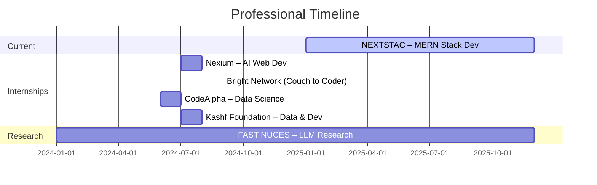

<div align="center">


<p align="center">
  <a href="https://readme-typing-svg.demolab.com">
    
  </a>
</p>

<p align="center">
  <a href="https://my-portfolio-hazel-seven-40.vercel.app">
    
  </a>
  <a href="https://github.com/ShahzebFaisal5649">
    
  </a>
  <a href="https://www.linkedin.com/in/shahzeb-faisal-8b9190321/">
    
  </a>
  <a href="mailto:shahzebfaisal5649@gmail.com">
    
  </a>
</p>

<p align="center">
  
  
  
  
</p>

</div>

---


## 👨‍💻 About Me


```yaml
name: Shahzeb Faisal
role: Full Stack AI Developer
company: NEXTSTAC (Current)
education: BS Data Science @ FAST NUCES Lahore (2025)
location: Lahore, Pakistan

current_focus:
  - MERN Stack + AI Integration
  - LLM-Powered Web Applications
  - 3D/WebGL Configurators (Three.js)
  - Production Serverless Deployments

core_stack:
  frontend:  [Next.js 15, React 18, TypeScript, Tailwind CSS]
  backend:   [Node.js, Express.js, Django REST, FastAPI]
  ai_ml:     [OpenAI, LangChain, HuggingFace, TensorFlow, PyTorch]
  databases: [MongoDB Atlas, PostgreSQL, Supabase, MySQL, Redis]
  devops:    [Vercel, Git, GitHub Actions]
```

> *"I don't just build features — I architect intelligent systems that solve real problems and ship to production."*

<br clear="right"/>

---


## 📊 GitHub Analytics

<div align="center">


</div>

---


## 💼 Experience



<br>

### 🚀 MERN Stack Developer · NEXTSTAC *(Jan 15, 2025 – Present)*
📍 Current Role

- Engineered **DesignCustomBox** ([designcustombox.com](https://designcustombox.com)) — a full-stack custom packaging e-commerce platform live in production, delivered **solo in 7 days**
- Built a real-time **3D WebGL configurator** (React Three Fiber / Three.js), live pricing engine, and drag-and-drop artwork upload
- Implemented **Stripe** checkout, **Google OAuth 2.0**, JWT auth, full admin CMS with Recharts analytics, and **Gemini AI** chat assistant
- Built 15+ REST API endpoints with LRU caching, rate limiting, and async concurrency for high-traffic load
- Architected a scalable **interactive seating map** rendering 15,000+ seats with smooth performance
- Deployed as a **serverless monorepo on Vercel + MongoDB Atlas** with strict TypeScript and modular architecture

`React 18` `TypeScript` `Node.js` `Express.js` `MongoDB` `Three.js` `Stripe` `Gemini AI` `Vercel`

---

### 🤖 AI-Web Development Intern · Nexium *(Jul – Aug 2024)*
📍 Lahore, Pakistan · 🏆 Certificate of Participation

- Built **Resume Tailor** — GPT-4 powered parsing, ATS optimization, and job matching; 1000+ users, 30% accuracy improvement
- Developed **Blog Summarizer** with web scraping, NLP summarization, Urdu translation, and dual DB (Supabase + MongoDB)
- Created **QuoteGen AI** — LLM topic generation with WCAG 2.1 AA accessible server-side rendered UI

`Next.js 15` `OpenAI GPT-4` `TypeScript` `Tailwind CSS` `Supabase` `MongoDB` `Prisma`

---

### 💻 Software Development Trainee · Bright Network – Technology Academy *(Sep 2024)*
📍 Remote · 🏆 Couch to Coder 2024 · *Credential: GD3LDZLN3HN4O2*

- Completed intensive bootcamp: modern web, Agile/Scrum, Git, testing strategies, and LLM-powered automation
- Built full-stack apps with Next.js + TypeScript and Supabase backend integration

---

### 📊 Data Science Intern · CodeAlpha *(Jun – Jul 2024)*
📍 Remote · 🏆 Certificate · *Student ID: CAJN1/12567*

| Project | Model | Result |
|---------|-------|--------|
| Stock Price Prediction | LSTM Time Series | **85% directional** |
| Customer Segmentation | K-Means + PCA + RFM | Marketing insights |

Improved decision accuracy by **25%** and cut pipeline processing time by **30%**.

---

### 🛠️ Data & Software Intern · Kashf Foundation *(Jul – Aug 2024)*
📍 Lahore, Pakistan · 🏆 Official Completion Letter

- Built compliance dashboard with **real-time analytics** and KPI monitoring
- Optimized SQL queries and DB schema, cutting response time by **40%**
- Enhanced Android app UI/UX with Material Design; resolved production-level Android dev issues
- Worked across SQL Server, demo dashboards, Student Management System, and e-commerce UI

---

### 🔬 Research Assistant · FAST NUCES Lahore *(Jan 2024 – Present)*
**Thesis:** *"Exploring Publicly Available LLMs for Conversational Chatbots"*  
**Supervisor:** Dr. Esha Tur Razia Babar

Investigating persona-based chatbot architectures, bias mitigation in open-source LLMs (LLaMA 2/3, Mistral, Gemma), LoRA/QLoRA fine-tuning, and production deployment strategies.

---


## 🚀 Featured Projects

### 🏆 Flagship — Live in Production

<table>
<tr>
<td width="50%">

**🎁 DesignCustomBox** · *[designcustombox.com](https://designcustombox.com)*

Full-stack custom packaging e-commerce with real-time 3D WebGL configurator, live pricing, Stripe checkout, Google OAuth, Gemini AI chat, and admin CMS — built solo and shipped to production in 7 days.

`React 18` `Three.js` `Node.js` `MongoDB` `Stripe` `Gemini AI` `Vercel`

</td>
<td width="50%">

**📚 Edu Connect Platform** · *[GitHub →](https://github.com/ShahzebFaisal5649/DB_Lab_Project)*

Real-time tutor-student matching platform with WebSocket chat, role-based auth, session scheduling, and subject-based matching — built for 1000+ concurrent users.

`React` `Node.js` `Express.js` `MySQL` `Socket.io` `JWT`

</td>
</tr>
<tr>
<td width="50%">

**🎙️ AI Voice Assistant – Restaurant Booking** · *FYP*

Voice-driven reservation system with STT/TTS, NLP intent understanding, and a restaurant manager dashboard with real-time table availability.

`Next.js 15` `Django REST` `PostgreSQL` `NLP` `STT/TTS`

</td>
<td width="50%">

**🗺️ Interactive Seating Map + Scalable API**

Renders 15,000+ seats with smooth UX, LRU-cached Express API, burst-tolerant rate limiting, and async queue concurrency.

`React` `TypeScript` `Vite` `Express.js` `Node.js`

</td>
</tr>
</table>

### 🧠 AI & Machine Learning

| Project | Stack | Highlight |
|---------|-------|-----------|
| **Image Captioning System** | TensorFlow · ResNet50 · LSTM · Attention | BLEU-4: **0.875**, 92% val accuracy |
| **Music Sentiment Analysis** | BERT · XGBoost · SpaCy · Plotly | 89% emotion classification, 50k+ lyrics |
| **Environmental Satellite Analysis** | GDAL · Rasterio · Python | NDVI analysis, **90%** detection accuracy |
| **Smart City Data Pipeline** | Pandas · Python | 13.5M+ records, 98.75% quality |

### 🌐 Full-Stack & Web

| Project | Stack | Link |
|---------|-------|------|
| **DesignCustomBox** | React 18 · Three.js · Node.js · MongoDB · Stripe · Gemini AI | [→ Live](https://designcustombox.com) |
| **Blog Summarizer AI** | Next.js 15 · MongoDB · Supabase · NLP | [→](https://github.com/ShahzebFaisal5649/Nexium_Shahzeb_Faisal_Assign2) |
| **Edu Connect Platform** | React · Node.js · MySQL · WebSocket | [→](https://github.com/ShahzebFaisal5649/DB_Lab_Project) |
| **Election DApp** | Solidity · Web3.js · Ethereum · React | [→](https://github.com/ShahzebFaisal5649/election-dapp) |
| **E-Shop E-Commerce** | PHP · SQL Server · Bootstrap | [→](https://github.com/ShahzebFaisal5649/E-Shop) |
| **Azure Bicep IaC** | Azure · Bicep · AKS · GitHub Actions | [→](https://github.com/ShahzebFaisal5649/Bicep-Shahzeb-Ass) |
| **Movie Showcase** | JavaScript · TMDb API · Bootstrap 5 | [→](https://github.com/ShahzebFaisal5649/Movie-Showcase) |

---


## ⚡ Tech Stack

### Languages


### Frontend & UI


### Backend & APIs


### AI / ML / LLMs


### Databases & Cloud


---


## 🎓 Education & Certifications

### 🏛️ BS Data Science · FAST NUCES Lahore *(2021 – 2025)*
**Research Thesis:** *"Exploring Publicly Available LLMs for Conversational Chatbots"*  
**Supervisor:** Dr. Esha Tur Razia Babar  
Core areas: Machine Learning · Deep Learning · NLP · Big Data · Cloud Computing · Computer Vision

### 📜 Professional Certifications

| Certificate | Issuer | Date | Credential |
|-------------|--------|------|------------|
| 🚀 **AI-First Web Development** | Nexium | Jul–Aug 2024 | Certificate of Participation |
| 💻 **Couch to Coder 2024** | Bright Network – Technology Academy | Sep 23, 2024 | GD3LDZLN3HN4O2 |
| 📊 **Data Science Internship** | CodeAlpha | Jun–Jul 2024 | CAJN1/12567 |
| 🛠️ **IT Internship Completion** | Kashf Foundation | Aug 12, 2024 | Official Letter |

---


## 📬 Connect

<div align="center">

| 📧 Email | 💼 LinkedIn | 💻 GitHub | 🌐 Portfolio |
|:---:|:---:|:---:|:---:|
| [shahzebfaisal5649@gmail.com](mailto:shahzebfaisal5649@gmail.com) | [shahzeb-faisal](https://www.linkedin.com/in/shahzeb-faisal-8b9190321/) | [@ShahzebFaisal5649](https://github.com/ShahzebFaisal5649) | [Visit Portfolio](https://my-portfolio-hazel-seven-40.vercel.app) |

**📞 +92 302 0418510 · 📍 Lahore, Pakistan · 🌍 Open to remote & on-site roles**

<br/>

[](https://github.com/ShahzebFaisal5649)

</div>


